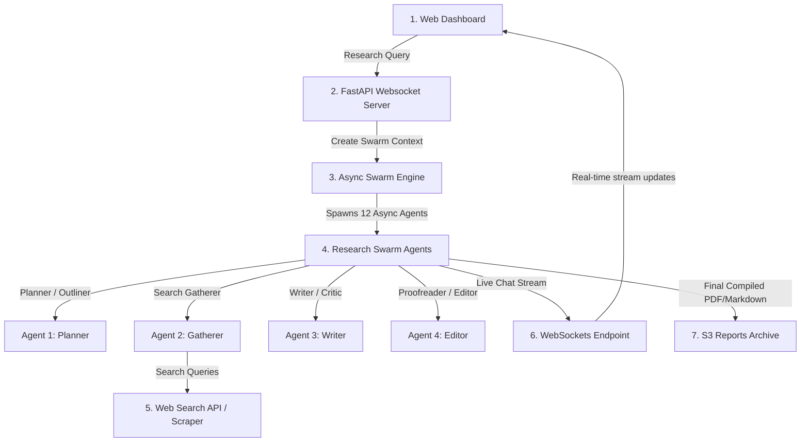
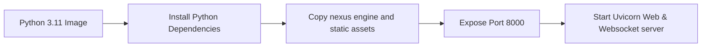
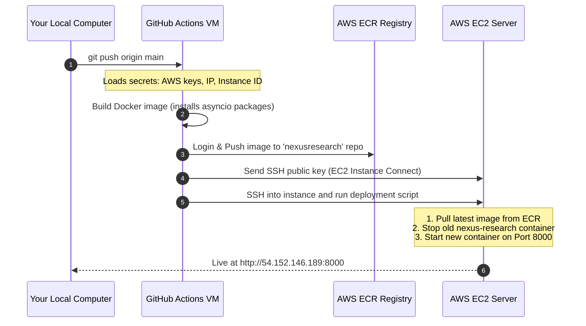

# nexus-research: MLOps and Deployment Guide

This document provides a beginner-friendly explanation of how the **nexus-research** application works, how it is packaged using Docker, and how it is deployed automatically to AWS using GitHub Actions.

---

## 1. How nexus-research Works (The Swarm Intelligence Flow)

nexus-research is an AI multi-agent research swarm. When you query a topic, it launches a swarm of 12 distinct, collaborating agents (planners, gatherers, writers, editors) to perform deep-web search, gather context, compile drafts, debate facts, and write structured, publication-grade intelligence reports. It uses WebSockets to stream the agents' live conversations and reports to your browser.

### The Swarm Engine Flow:


---

## 2. Code Structure

nexus-research relies on an asynchronous Python worker engine to support 12 agents writing concurrently.

```text
nexus-research/
├── nexus/
│   ├── web/
│   │   ├── app.py       # FastAPI server with WebSocket routes
│   │   └── static/      # AMOLED dark dashboard frontend
│   ├── engine/          # Swarm orchestrator and state machine
│   ├── agents/          # Custom prompts & agent personas (12 files)
│   └── config.py        # Environment variables & API credentials
├── Dockerfile           # Python asyncio container
└── requirements.txt     # Python libraries (WebSockets, google-genai, PyPDF)
```

---

## 3. The Docker Blueprint (How We Containerize)

We use a simple and lightweight Docker container:



### Why we do this:
* **WebSocket Streaming Support:** Standard Python containers are naturally lightweight, but we make sure `uvicorn` is configured to run asynchronously to support multiple concurrent WebSocket streams without dropping active chat updates.
* **Single Port Utility:** The backend FastAPI app mounts `/static` containing the dark theme dashboard UI, letting you run everything on a single port (`8000`).

---

## 4. The GitHub Actions CD Pipeline (Continuous Deployment)

When you run `git push origin main`, GitHub starts a temporary virtual machine to execute the assembly line defined in `.github/workflows/deploy.yml`:



---

## 5. AWS Cloud Components

nexus-research relies on these core AWS services:
1. **AWS ECR (Elastic Container Registry):** A private cloud folder where your built Docker image is stored.
2. **AWS EC2 (Elastic Compute Cloud):** A virtual server (`t3.micro`) running Ubuntu 22.04 that downloads and hosts the Docker container.
3. **AWS Security Group:** An inbound firewall rule configured to open **Port 8000** (so you can view the dashboard UI) and **Port 22** (for secure SSH management).
4. **AWS S3 (Simple Storage Service):** Used by the application to store compiled research PDFs and markdown reports permanently.
