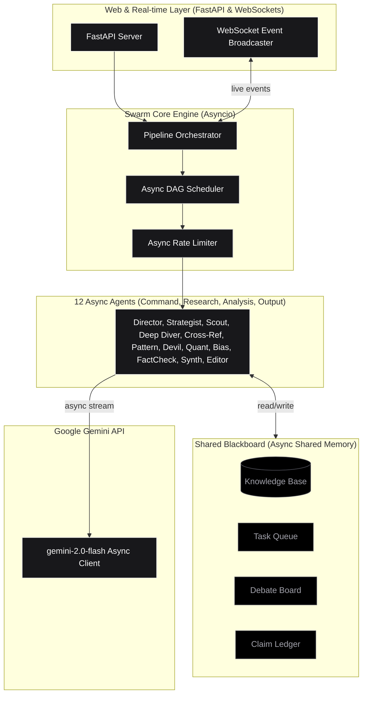
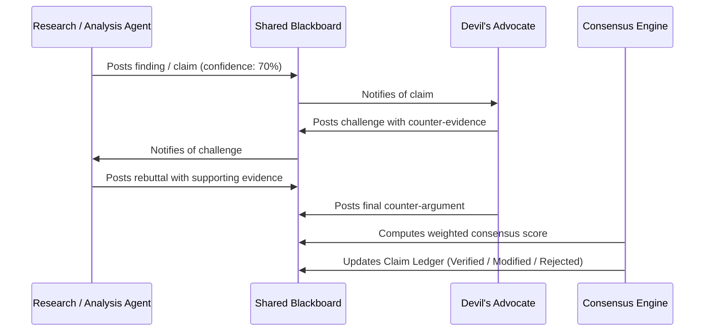

# NexusResearch — Python Multi-Agent Swarm Platform

NexusResearch is a next-generation, high-performance Python application implementing a **swarm-intelligence architecture** where 12 specialized AI agents dynamically collaborate, debate, cross-reference, and reach consensus to generate deeply researched, fact-verified intelligence reports.

Built with **FastAPI**, **`asyncio`**, **Google Gemini API**, WebSockets, and an **AMOLED Black & White High-Contrast UI**, NexusResearch turns complex research queries into structured, evidence-backed reports with real-time topology visualization.

---

## 🏛️ System Architecture Topology



---

## ⚡ DAG Parallel Pipeline & Streaming Overlap

The 8 research phases execute as an optimized **Async DAG (Directed Acyclic Graph)** with **streaming overlap**, cutting total execution wall-clock time by 30-40%:

```mermaid
graph LR
    subgraph WAVE_1["Wave 1"]
        P1["Phase 1: Decomposition\n(Director)"]
    end

    subgraph WAVE_2["Wave 2 (Parallel)"]
        P2a["Phase 2: Reconnaissance\n(Scout)"]
        P2b["Phase 2: Strategy\n(Strategist)"]
    end

    subgraph WAVE_3["Wave 3 (Streaming Overlap)"]
        P3["Phase 3: Deep Research\n(Deep Diver + Cross-Ref)"]
        P4["Phase 4: Analysis\n(Pattern + Quantifier)"]
    end

    subgraph WAVE_4["Wave 4 (Parallel)"]
        P5["Phase 5: Debate\n(Devil's Advocate + Bias)"]
    end

    subgraph WAVE_5["Wave 5 (Streaming Overlap)"]
        P6["Phase 6: Verification\n(Fact Checker)"]
        P7["Phase 7: Synthesis\n(Synthesizer)"]
    end

    subgraph WAVE_6["Wave 6"]
        P8["Phase 8: Polish\n(Visualizer + Editor)"]
    end

    P1 --> P2a
    P1 --> P2b
    P2a --> P3
    P2b --> P3
    P3 -.->|stream partial| P4
    P3 --> P5
    P4 --> P5
    P5 --> P6
    P6 -.->|stream partial| P7
    P7 --> P8

    style P1 fill:#18181b,stroke:#ffffff,color:#fff
    style P2a fill:#18181b,stroke:#e4e4e7,color:#fff
    style P2b fill:#18181b,stroke:#f4f4f5,color:#fff
    style P3 fill:#18181b,stroke:#d4d4d8,color:#fff
    style P4 fill:#18181b,stroke:#ffffff,color:#fff
    style P5 fill:#18181b,stroke:#a1a1aa,color:#fff
    style P6 fill:#18181b,stroke:#ffffff,color:#fff
    style P7 fill:#18181b,stroke:#e4e4e7,color:#fff
    style P8 fill:#18181b,stroke:#d4d4d8,color:#fff
```



---

## ⚔️ Adversarial Debate Protocol

Disputed claims automatically enter a structured multi-round debate resolved by a weighted multi-factor consensus engine:



The consensus engine evaluates:
$$\text{Defense Score} = 0.35(\text{Evidence Strength}) + 0.30(\text{Coherence}) + 0.15(\text{Source Diversity}) + 0.20(1 - \text{Counter Quality})$$

---

## 🤖 The 12 AI Agents

| Tier | Agent | Icon | Role & System Prompt Focus |
|------|-------|------|---------------------------|
| **Command** | **Director** | `[DIR]` | Decomposes raw query into subtasks with dependencies and priority levels. |
| **Command** | **Strategist** | `[STR]` | Monitors research gaps mid-session and dynamically adapts strategy. |
| **Research** | **Scout** | `[SCT]` | Broad reconnaissance across all subtasks for rapid surface coverage. |
| **Research** | **Deep Diver** | `[DDV]` | Focused, granular investigation into targeted sub-topics. |
| **Research** | **Cross-Referencer** | `[CRF]` | Identifies cross-cutting connections and contradictions between subtasks. |
| **Analysis** | **Pattern Analyst** | `[PAT]` | Discovers recurring trends, anomalies, and statistical patterns. |
| **Analysis** | **Devil's Advocate** | `[DVA]` | Challenges findings with critical counter-arguments and alternative explanations. |
| **Analysis** | **Quantifier** | `[QNT]` | Extracts, validates, and contextualizes numerical data and statistics. |
| **Analysis** | **Bias Detector** | `[BIA]` | Scans research for cognitive biases, framing effects, and logical fallacies. |
| **Output** | **Fact Checker** | `[FCK]` | Final verification pass; assigns confidence scores (0-100%) to all claims. |
| **Output** | **Synthesizer** | `[SYN]` | Compiles verified evidence into an authoritative research report. |
| **Output** | **Visualizer** | `[VIZ]` | Generates structured summary tables and key statistics matrices. |
| **Output** | **Editor** | `[EDI]` | Final polish for narrative flow, clarity, style, and coherence. |

---

## 🛠️ Project Structure

```
nexus-research/
├── pyproject.toml              # Python package metadata & dependencies
├── requirements.txt            # FastAPI, Uvicorn, Pydantic, aiohttp, WebSockets
├── main.py                     # CLI & Web Server entry point
├── nexus/
│   ├── __init__.py
│   ├── config.py               # Pydantic BaseSettings & environment config
│   ├── api/
│   │   └── gemini_client.py    # Async Gemini client with retries & rate limiting
│   ├── core/
│   │   ├── blackboard.py       # Thread-safe async shared memory
│   │   ├── task_queue.py       # Priority queue with dependency resolution
│   │   ├── claim_ledger.py     # Verified claims repository
│   │   ├── debate_engine.py    # Adversarial debate protocol & scoring
│   │   ├── rate_limiter.py     # Semaphore + token bucket rate limiter
│   │   ├── scheduler.py        # Async DAG wave scheduler
│   │   └── pipeline.py         # 8-phase research pipeline orchestrator
│   ├── agents/
│   │   ├── base_agent.py       # Base Agent class with sliding memory
│   │   ├── registry.py         # Agent factory & depth manager
│   │   └── prompts.py          # System prompts for all 12 agents
│   └── web/
│       ├── app.py              # FastAPI server & REST API
│       ├── websocket.py        # Real-time WebSocket connection manager
│       └── static/             # AMOLED Black & White Web UI
│           ├── index.html
│           ├── css/            # AMOLED dark tokens & layout
│           └── js/             # WebSocket client & live topology renderer
└── README.md
```

---

## 💻 Quick Start

### Prerequisites
- Python 3.10 or higher.
- A **Google Gemini API Key** (Free tier supported).

### Installation & Server Run

1. **Clone the Repository**:
   ```bash
   git clone https://github.com/siddarth1872004/nexus-research.git
   cd nexus-research
   ```

2. **Install Dependencies**:
   ```bash
   pip install -r requirements.txt
   ```

3. **Start the FastAPI Server**:
   ```bash
   python main.py --server --port 8000
   ```

4. **Open Web UI**:
   Navigate to `http://localhost:8000` in your browser.

5. **CLI Execution Mode**:
   You can also run research queries directly from the terminal:
   ```bash
   python main.py --query "What are the latest advances in quantum computing?" --depth standard
   ```

---

## 📜 License

Distributed under the **MIT License**. See `LICENSE` for more information.
