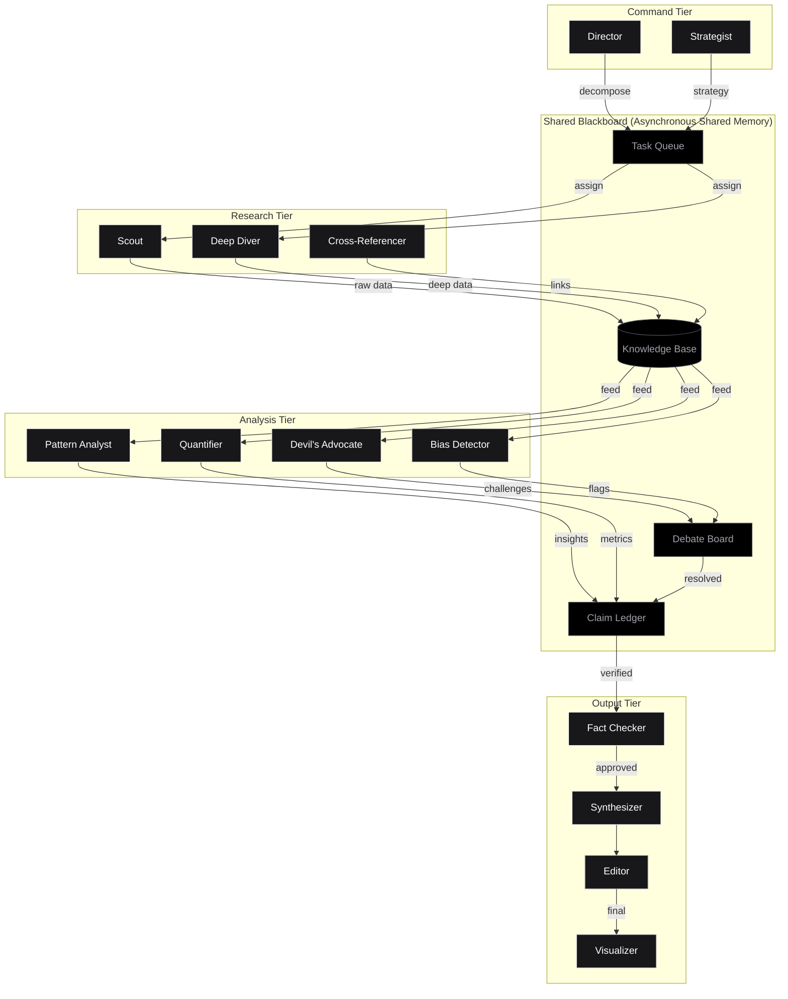
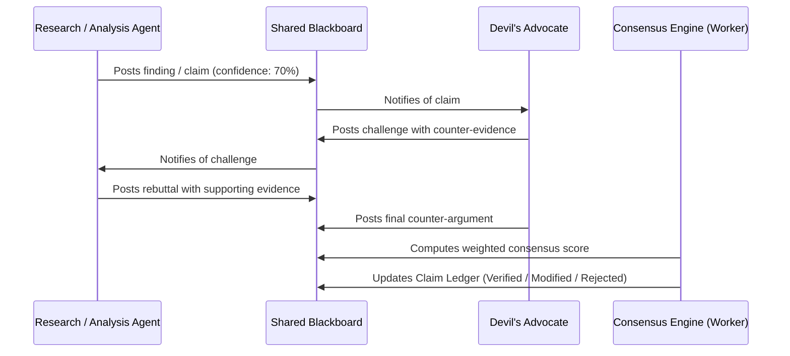

```mermaid
graph LR
    subgraph WAVE_1["Wave 1"]
        P1["Phase 1: Decomposition\n(Director)"]
    end

    subgraph WAVE_2["Wave 2 (Parallel)"]
        P2a["Phase 2: Reconnaissance\n(Scout)"]
        P2b["Phase 2: Strategy\n(Strategist)"]
    end

    subgraph WAVE_3["Wave 3 (Streaming Overlap)"]
        P3["Phase 3: Deep Research\n(Deep Diver + Cross-Ref)"]
        P4["Phase 4: Analysis\n(Pattern + Quantifier)"]
    end

    subgraph WAVE_4["Wave 4 (Parallel)"]
        P5["Phase 5: Debate\n(Devil's Advocate + Bias)"]
    end

    subgraph WAVE_5["Wave 5 (Streaming Overlap)"]
        P6["Phase 6: Verification\n(Fact Checker)"]
        P7["Phase 7: Synthesis\n(Synthesizer)"]
    end

    subgraph WAVE_6["Wave 6"]
        P8["Phase 8: Polish\n(Visualizer + Editor)"]
    end

    P1 --> P2a
    P1 --> P2b
    P2a --> P3
    P2b --> P3
    P3 -.->|stream partial| P4
    P3 --> P5
    P4 --> P5
    P5 --> P6
    P6 -.->|stream partial| P7
    P7 --> P8

    style P1 fill:#18181b,stroke:#ffffff,color:#fff
    style P2a fill:#18181b,stroke:#e4e4e7,color:#fff
    style P2b fill:#18181b,stroke:#f4f4f5,color:#fff
    style P3 fill:#18181b,stroke:#d4d4d8,color:#fff
    style P4 fill:#18181b,stroke:#ffffff,color:#fff
    style P5 fill:#18181b,stroke:#a1a1aa,color:#fff
    style P6 fill:#18181b,stroke:#ffffff,color:#fff
    style P7 fill:#18181b,stroke:#e4e4e7,color:#fff
    style P8 fill:#18181b,stroke:#d4d4d8,color:#fff
```

# NexusResearch — Multi-Agent Swarm Research Platform

NexusResearch is a state-of-the-art, high-performance web application implementing a **swarm-intelligence architecture** where 12 specialized AI agents dynamically collaborate, debate, cross-reference, and reach consensus to generate deeply researched, fact-verified intelligence reports.

Built with an **AMOLED Black & White High-Contrast UI**, system-native typography, Web Worker offloading, and a DAG-based parallel execution pipeline, NexusResearch turns complex research queries into structured, evidence-backed reports with real-time topology visualization.

---

## 🏛️ Architecture Overview

NexusResearch operates on a **Blackboard Architecture** combined with an **Adversarial Debate Protocol** and **DAG Parallel Scheduling**.

### System Architecture Topology



---

## ⚡ DAG Parallel Pipeline & Streaming Overlap

The 8 research phases execute as an optimized **Directed Acyclic Graph (DAG)** with **streaming overlap**, cutting total execution wall-clock time by 30-40%:



---

## ⚔️ Adversarial Debate Protocol

Disputed claims automatically enter a structured multi-round debate resolved by a weighted multi-factor consensus engine:



The consensus engine evaluates:
$$\text{Defense Score} = 0.35(\text{Evidence Strength}) + 0.30(\text{Coherence}) + 0.15(\text{Source Diversity}) + 0.20(1 - \text{Counter Quality})$$

---

## 🤖 The 12 AI Agents

| Tier | Agent | Icon | Role & System Prompt Focus |
|------|-------|------|---------------------------|
| **Command** | **Director** | `[DIR]` | Decomposes raw query into subtasks with dependencies and priority levels. |
| **Command** | **Strategist** | `[STR]` | Monitors research gaps mid-session and dynamically adapts strategy. |
| **Research** | **Scout** | `[SCT]` | Broad reconnaissance across all subtasks for rapid surface coverage. |
| **Research** | **Deep Diver** | `[DDV]` | Focused, granular investigation into targeted sub-topics. |
| **Research** | **Cross-Referencer** | `[CRF]` | Identifies cross-cutting connections and contradictions between subtasks. |
| **Analysis** | **Pattern Analyst** | `[PAT]` | Discovers recurring trends, anomalies, and statistical patterns. |
| **Analysis** | **Devil's Advocate** | `[DVA]` | Challenges findings with critical counter-arguments and alternative explanations. |
| **Analysis** | **Quantifier** | `[QNT]` | Extracts, validates, and contextualizes numerical data and statistics. |
| **Analysis** | **Bias Detector** | `[BIA]` | Scans research for cognitive biases, framing effects, and logical fallacies. |
| **Output** | **Fact Checker** | `[FCK]` | Final verification pass; assigns confidence scores (0-100%) to all claims. |
| **Output** | **Synthesizer** | `[SYN]` | Compiles verified evidence into an authoritative research report. |
| **Output** | **Visualizer** | `[VIZ]` | Generates structured summary tables and key statistics matrices. |
| **Output** | **Editor** | `[EDI]` | Final polish for narrative flow, clarity, style, and coherence. |

---

## 🚀 Key Features & Performance Optimizations

### 1. High-Performance Architecture
- **Semaphore + Token-Bucket Rate Limiter**: Enforces strict API concurrency limits with priority queues (Command Tier > Research Tier > Analysis Tier).
- **Hash Deduplication Cache**: Reuses identical prompt responses and deduplicates concurrent in-flight requests.
- **Web Worker Offloading**: Runs Markdown-to-HTML parsing and Debate Consensus Scoring in background Web Workers to guarantee 60fps UI smoothness.
- **rAF DOM Batching & Object Pooling**: Recycles canvas objects and batches state updates to prevent layout thrashing.

### 2. State-of-the-Art Mission Control UI
- **AMOLED Black & White Aesthetic**: Pure `#000000` AMOLED background, crisp high-contrast text, zero emojis, and native system typography (`system-ui`).
- **Interactive Topology Graph**: 30fps canvas force-directed network showing active agent nodes, directional flow dashes, and hover tooltips.
- **Virtualized Activity Feed**: Timestamped, filterable scrolling log handling 200+ events effortlessly.
- **Confidence Heatmap & Debate Thread Viewer**: Drill down into verified claims, argument rounds, and confidence bars.

---

## 🛠️ Project Structure

```
nexus-research/
├── index.html              # Mission Control HTML structure
├── css/
│   ├── tokens.css          # AMOLED black & white design system tokens
│   ├── reset.css           # Modern CSS reset
│   ├── layout.css          # Mission Control grid system
│   ├── components.css      # Agent cards, buttons, feeds, modals
│   ├── visualizations.css  # Topology overlay & heatmap grid
│   └── animations.css      # GPU-accelerated keyframe definitions
├── js/
│   ├── main.js             # Application entry point & state binding
│   ├── state.js            # Reactive Pub/Sub state store
│   ├── api/
│   │   └── gemini.js       # Gemini API client with SSE streaming & retries
│   ├── core/
│   │   ├── Blackboard.js   # Shared memory system (KB, TaskQueue, Debate, Claims)
│   │   ├── TaskQueue.js    # Priority queue with dependency resolution
│   │   ├── ClaimLedger.js  # Verified claims repository
│   │   ├── DebateEngine.js # Adversarial debate protocol & scoring
│   │   ├── Scheduler.js    # DAG wave execution engine
│   │   ├── RateLimiter.js  # Semaphore + token-bucket concurrency manager
│   │   ├── RequestCache.js # Hash-based dedup cache
│   │   └── Pipeline.js     # 8-phase research pipeline orchestrator
│   ├── agents/
│   │   ├── Agent.js        # Base Agent class
│   │   ├── AgentRegistry.js# Agent factory & depth lifecycle manager
│   │   └── prompts.js      # System prompts for all 12 agents
│   ├── ui/
│   │   ├── renderer.js     # DOM factory & rAF scheduler
│   │   ├── AgentCards.js   # Agent card grid component
│   │   ├── Topology.js     # Canvas force-directed graph renderer
│   │   ├── ActivityFeed.js # Real-time virtualized feed component
│   │   ├── ReportView.js   # Markdown report viewer & export manager
│   │   ├── ProgressBar.js  # 8-phase progress bar component
│   │   ├── DebateView.js   # Interactive debate thread viewer
│   │   ├── Heatmap.js      # Confidence heatmap grid component
│   │   └── Modal.js        # Settings & history modal system
│   ├── workers/
│   │   ├── markdown.worker.js  # Background Web Worker for markdown parsing
│   │   └── consensus.worker.js # Background Web Worker for debate scoring
│   └── utils/
│       ├── helpers.js      # Formatting, debounce, throttle, hashing
│       ├── storage.js      # localStorage wrapper
│       ├── markdown.js     # Main-thread markdown parser fallback
│       └── ObjectPool.js   # Reusable object pool
└── README.md
```

---

## 💻 Quick Start

### Prerequisites
- Any modern web browser (Chrome, Edge, Firefox, Safari).
- A **Google Gemini API Key** (Free tier supported).

### Local Running

1. **Clone the Repository**:
   ```bash
   git clone https://github.com/siddarth1872004/nexus-research.git
   cd nexus-research
   ```

2. **Serve the Application**:
   Since the app uses native ES Modules and Web Workers, it should be served via HTTP:
   ```bash
   npx serve -l 3000
   ```
   *or using Python:*
   ```bash
   python -m http.server 3000
   ```

3. **Open in Browser**:
   Navigate to `http://localhost:3000`.

4. **Configure API Key**:
   Click the **Settings** gear icon in the top right, enter your Gemini API Key, and click **Validate & Save**.

5. **Start Researching**:
   Enter your research topic (e.g., *"What are the latest breakthroughs in solid-state battery technology?"*), select research depth (**Quick**, **Standard**, **Deep**, or **Exhaustive**), and click **Start Research**!

---

## 📜 License

Distributed under the **MIT License**. See `LICENSE` for more information.
