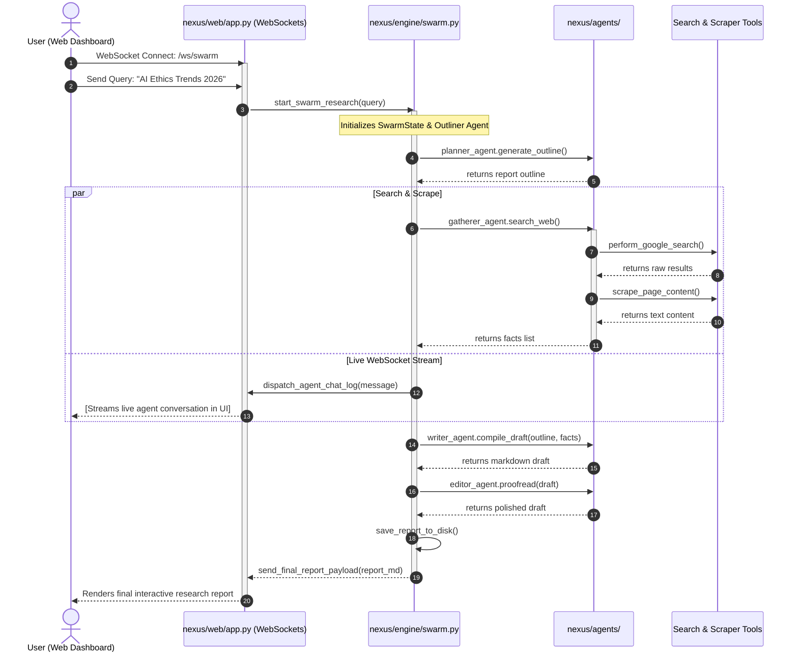

# nexus-research: Tech Stack and Code Flow Guide

This document breaks down the technology stack and code execution flow for **nexus-research** in detail.

---

## 1. The Technology Stack

nexus-research is an asynchronous multi-agent orchestration service that streams collaborative research logs to the web interface via WebSockets:

```
[ Web Dashboard ] ◄──WebSocket Connection──► [ FastAPI Server ]
                                                  │
                            ┌─────────────────────┴─────────────────────┐
                            ▼                                           ▼
                 [ Async Swarm Engine ]                       [ External Services ]
                   - 12 Concurrent Agents                       - Google Search API
                   - Outliner, Scraper, Writer, Editor          - Web Scrapers / PDF Parser
                   - WebSocket Message Dispatcher               - Gemini API
```

### Core Technologies Used:
* **FastAPI & Uvicorn (Asynchronous):** The backend server. It relies on async endpoints and WebSockets to handle continuous streams of data from agents.
* **Python Asyncio:** Native Python asynchronous runtimes are utilized to manage the 12 agents executing and talking concurrently.
* **Google Gemini API (google-genai SDK):** Powering the reasoning engine of each agent persona.
* **Web Scrapers & Search APIs:** Used by gathering agents to retrieve raw HTML and parse text/files from search engine pages.
* **Markdown Compiler:** Compiles final formatted markdown files into downloadable reports.

---

## 2. Code Execution Flow (Function-by-Function)

Here is how a research swarm session runs:



---

## 3. Key Files and Imports Directory Map

1. **`nexus/web/app.py`**
   * *Entrypoint:* Defines the `/ws/swarm` WebSocket endpoint and mounts static files from `static/`.
2. **`nexus/engine/swarm.py`**
   * *Orchestrator:* Houses the main loop that spins up concurrent tasks for agents using Python's `asyncio.gather`.
3. **`nexus/agents/`**
   * Contained files represent the prompt frameworks, system instructions, and task scopes for each of the 12 swarm nodes (e.g. `planner.py`, `gatherer.py`, `critic.py`, `writer.py`).
4. **`nexus/web/static/`**
   * Contains the HTML dashboard that manages WebSocket reconnects, displays streaming console logs, and renders output markdowns.
